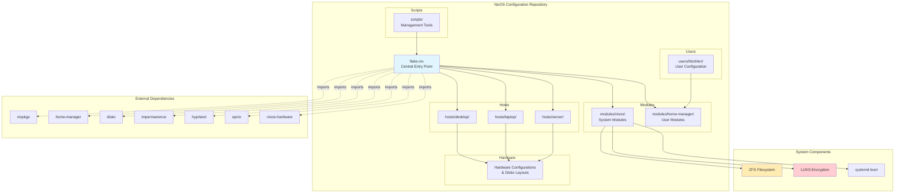
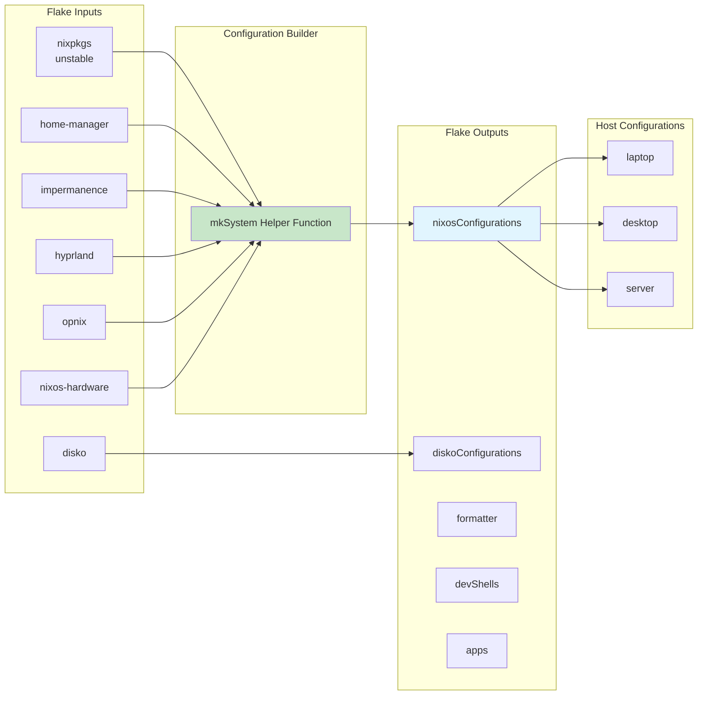
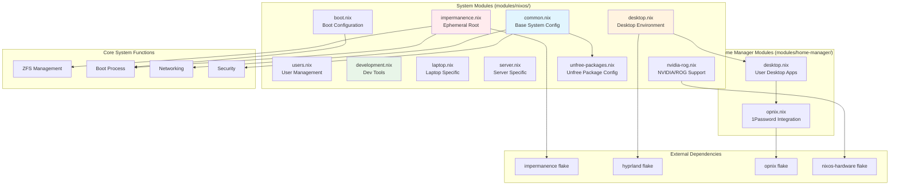
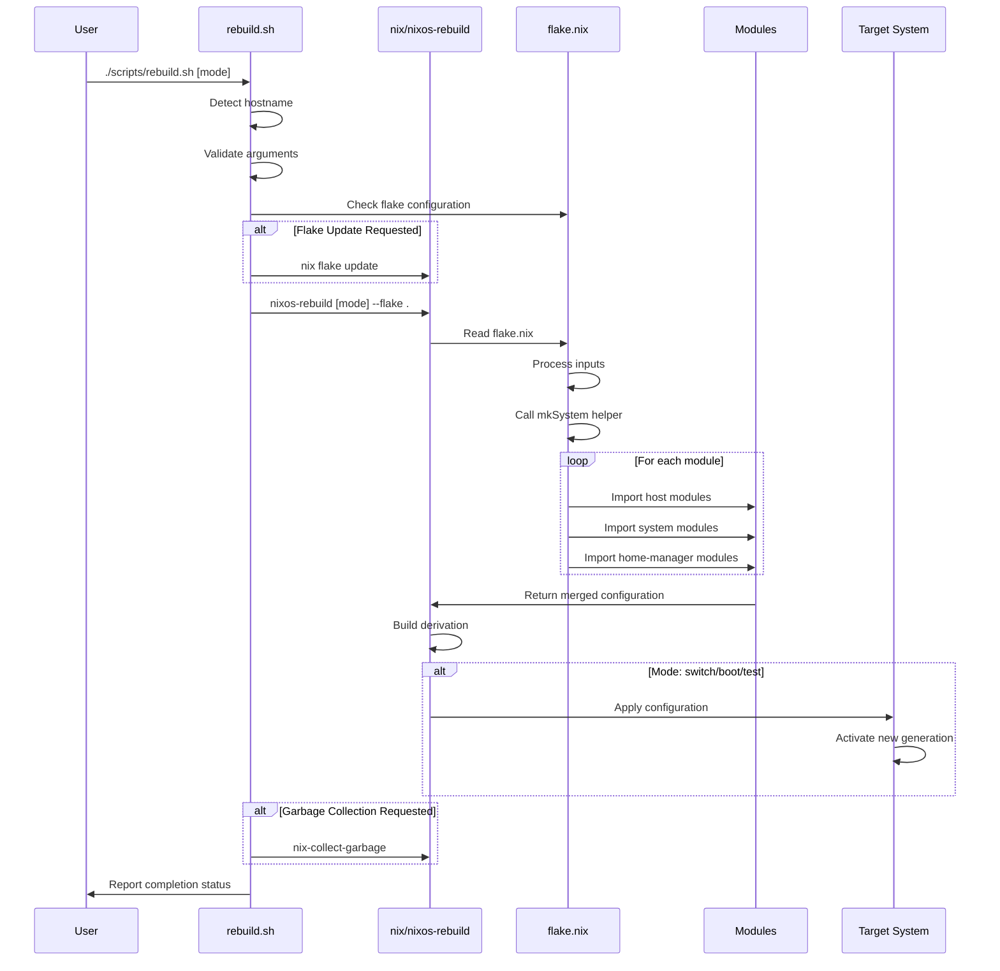
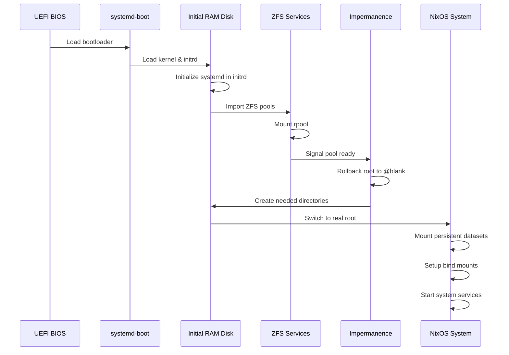

# NixOS Configuration Architecture

This document provides a comprehensive overview of the system architecture for this modular, flake-based NixOS configuration. The architecture follows modern NixOS best practices with emphasis on reproducibility, modularity, and security.

## Table of Contents

- [Architecture Philosophy](#architecture-philosophy)
- [Overall System Architecture](#overall-system-architecture)
- [Flake Structure & Configuration Flow](#flake-structure--configuration-flow)
- [Host Configuration Relationships](#host-configuration-relationships)
- [Module Dependencies](#module-dependencies)
- [Data Flow During System Rebuild](#data-flow-during-system-rebuild)
- [ZFS and Impermanence Architecture](#zfs-and-impermanence-architecture)
- [Boot Process and Initialization](#boot-process-and-initialization)
- [Design Rationale](#design-rationale)
- [Security Considerations](#security-considerations)
- [Performance Optimizations](#performance-optimizations)
- [Maintenance and Operations](#maintenance-and-operations)

## Architecture Philosophy

The system is built around the "Erase Your Darlings" philosophy, implementing:

- **Declarative Configuration**: Everything is defined in code
- **Reproducible Builds**: Hermetic system definition via Nix Flakes
- **Ephemeral Root**: Stateless system with opt-in persistence
- **Modular Design**: Reusable components across different machine types
- **Security by Default**: Hardened configurations with secure defaults

## Key Components Summary

| Component | Purpose | Implementation |
|-----------|---------|----------------|
| **Nix Flakes** | Reproducible system definition | `flake.nix` with locked inputs |
| **ZFS + LUKS** | Advanced filesystem with encryption | ZFS on LUKS with multiple datasets |
| **Impermanence** | Ephemeral root filesystem | Boot-time rollback to blank snapshot |
| **Disko** | Declarative disk partitioning | Per-host hardware configurations |
| **Home Manager** | User environment management | Declarative user configurations |
| **Module System** | Reusable configuration components | Shared nixos/ and home-manager/ modules |

## Repository Structure

```
├── flake.nix              # Central configuration entry point
├── hosts/                 # Host-specific configurations
│   ├── desktop/           # High-performance desktop setup
│   ├── laptop/            # Portable laptop configuration
│   └── server/            # Headless server setup
├── modules/               # Reusable configuration modules
│   ├── nixos/             # System-level modules
│   └── home-manager/      # User-level modules
├── users/                 # Per-user Home Manager configurations
├── scripts/               # System management and automation tools
└── docs/                  # Architecture and setup documentation
```

## Overall System Architecture



## Flake Structure & Configuration Flow



## Host Configuration Relationships

```mermaid
graph TB
    subgraph "Host: Desktop"
        DD[default.nix]
        DHW[hardware-configuration.nix]
        DDZ[hardware/disko-zfs.nix]
        
        subgraph "Desktop Modules"
            DC[common.nix]
            DU[users.nix]
            DB[boot.nix]
            DDE[desktop.nix]
            DDV[development.nix]
            DI[impermanence.nix]
            DN[nvidia-rog.nix]
        end
        
        subgraph "Hardware Profiles"
            HCPU[nixos-hardware.common-cpu-intel]
            HPC[nixos-hardware.common-pc]
            HSSD[nixos-hardware.common-pc-ssd]
        end
    end
    
    subgraph "Host: Laptop"
        LD[default.nix]
        LHW[hardware-configuration.nix]
        LDZ[hardware/disko-zfs.nix]
        
        subgraph "Laptop Modules"
            LC[common.nix]
            LU[users.nix]
            LB[boot.nix]
            LDE[desktop.nix]
            LI[impermanence.nix]
            LL[laptop.nix]
        end
    end
    
    subgraph "Host: Server"
        SD[default.nix]
        SHW[hardware-configuration.nix]
        SDZ[hardware/disko-zfs.nix]
        
        subgraph "Server Modules"
            SC[common.nix]
            SU[users.nix]
            SB[boot.nix]
            SI[impermanence.nix]
            SS[server.nix]
        end
    end
    
    subgraph "Shared Module Pool"
        SMC[modules/nixos/common.nix]
        SMU[modules/nixos/users.nix] 
        SMB[modules/nixos/boot.nix]
        SMD[modules/nixos/desktop.nix]
        SMDEV[modules/nixos/development.nix]
        SMI[modules/nixos/impermanence.nix]
        SML[modules/nixos/laptop.nix]
        SMS[modules/nixos/server.nix]
        SMN[modules/nixos/nvidia-rog.nix]
    end
    
    DD --> DDZ
    DD --> DHW
    DC --> SMC
    DU --> SMU
    DB --> SMB
    DDE --> SMD
    DDV --> SMDEV
    DI --> SMI
    DN --> SMN
    DD --> HCPU
    DD --> HPC
    DD --> HSSD
    
    LD --> LDZ
    LD --> LHW
    LC --> SMC
    LU --> SMU
    LB --> SMB
    LDE --> SMD
    LI --> SMI
    LL --> SML
    
    SD --> SDZ
    SD --> SHW
    SC --> SMC
    SU --> SMU
    SB --> SMB
    SI --> SMI
    SS --> SMS
    
    style SMC fill:#e8f5e8
    style SMU fill:#e8f5e8
    style SMB fill:#e8f5e8
    style SMD fill:#fff3e0
    style SMDEV fill:#fff3e0
    style SMI fill:#ffebee
    style SML fill:#e3f2fd
    style SMS fill:#f3e5f5
    style SMN fill:#e0f2f1
```



## Module Dependencies



## Data Flow During System Rebuild



## ZFS and Impermanence Architecture

```mermaid
graph TB
    subgraph "Physical Storage"
        DISK["/dev/nvme0n1<br/>Physical Disk"]
        LUKS[LUKS Encryption Layer]
    end
    
    subgraph "ZFS Pool Structure"
        POOL[rpool<br/>Main ZFS Pool]
        
        subgraph "Local Datasets (Ephemeral)"
            ROOT[rpool/local/root<br/>Ephemeral Root Filesystem]
            NIX[rpool/local/nix<br/>Nix Store]
        end
        
        subgraph "Safe Datasets (Persistent)" 
            PERSIST[rpool/safe/persist<br/>System Persistence]
            HOME[rpool/safe/home<br/>User Data]
        end
    end
    
    subgraph "Mount Points"
        MR[/ - tmpfs overlay]
        MN[/nix - Nix store]
        MP[/persist - Persistent data]
        MH[/home - User data]
        MB[/boot - Boot partition]
    end
    
    subgraph "Impermanence Management"
        BLANK[Blank Snapshot<br/>@blank on root]
        ROLLBACK[Boot-time Rollback<br/>systemd initrd service]
        BIND[Bind Mounts<br/>Selective persistence]
    end
    
    subgraph "Persistent Data Categories"
        SYS[System State<br/>SSH keys, logs, etc.]
        USER[User Data<br/>Configs, documents, etc.]
        APP[Application Data<br/>Caches, state files]
    end
    
    DISK --> LUKS
    LUKS --> POOL
    POOL --> ROOT
    POOL --> NIX
    POOL --> PERSIST
    POOL --> HOME
    
    ROOT --> MR
    NIX --> MN
    PERSIST --> MP
    HOME --> MH
    
    ROOT --> BLANK
    BLANK --> ROLLBACK
    ROLLBACK --> MR
    
    PERSIST --> BIND
    BIND --> SYS
    BIND --> USER
    BIND --> APP
    
    style ROOT fill:#ffcdd2
    style NIX fill:#c8e6c9
    style PERSIST fill:#bbdefb
    style HOME fill:#d1c4e9
    style BLANK fill:#ffab91
    style ROLLBACK fill:#ffab91
```

## Boot Process and Initialization



## Design Rationale

### 1. Flake-Based Architecture

**Decision**: Use Nix Flakes as the primary configuration mechanism

**Rationale**:
- **Reproducibility**: Hermetic builds with locked inputs ensure identical deployments
- **Composability**: Clean separation of inputs/outputs enables modular design
- **Version Management**: Explicit dependency versioning prevents configuration drift
- **Developer Experience**: Integrated development shells and formatting tools

**Trade-offs**:
- Increased complexity compared to channels
- Requires Nix flakes experimental feature
- Learning curve for traditional NixOS users

### 2. Ephemeral Root with Impermanence

**Decision**: Implement "Erase Your Darlings" with ZFS snapshots and selective persistence

**Rationale**:
- **Security**: Fresh system state on every boot eliminates persistent malware
- **Reproducibility**: Forces explicit declaration of all persistent state
- **Clean State**: Eliminates configuration drift and accumulated cruft
- **Debugging**: Easier to reason about system state when it's declarative

**Implementation**:
- ZFS `@blank` snapshot for instant root rollback
- Bind mounts from `/persist` for selected data
- Boot-time rollback in initrd stage for proper ordering

### 3. Modular Architecture

**Decision**: Separate system, user, and host-specific configurations

**Rationale**:
- **Reusability**: Common modules shared across different machine types
- **Maintainability**: Focused, single-responsibility modules
- **Flexibility**: Mix-and-match capabilities for different use cases
- **Testing**: Isolated modules enable easier testing and validation

**Structure**:
```
modules/
├── nixos/          # System-level modules
│   ├── common.nix  # Base configuration for all systems
│   ├── desktop.nix # Desktop environment setup
│   └── ...
├── home-manager/   # User-level modules
│   ├── desktop.nix # User desktop applications
│   └── ...
```

### 4. ZFS with LUKS Encryption

**Decision**: ZFS on top of LUKS for storage management

**Rationale**:
- **Snapshots**: Instant system snapshots for impermanence rollback
- **Compression**: Built-in compression saves disk space
- **Checksums**: Data integrity verification and automatic repair
- **Performance**: Advanced features like ARC caching and recordsize tuning
- **Encryption**: LUKS provides battle-tested full-disk encryption

**Configuration**:
- Different recordsizes optimized for workload (1M for Nix store, 128K for mixed data)
- Separate datasets for different data types and persistence requirements
- Automatic scrubbing for data integrity

### 5. Hardware Abstraction

**Decision**: Per-host hardware configurations with shared module imports

**Rationale**:
- **Hardware Specificity**: Each machine has unique disk layouts and hardware
- **Code Reuse**: Common functionality shared through module imports
- **Maintainability**: Hardware changes isolated to host-specific files
- **Community Support**: Leverage nixos-hardware for tested configurations

### 6. Declarative Disk Management

**Decision**: Use Disko for declarative disk partitioning

**Rationale**:
- **Reproducibility**: Disk layouts defined in code, not manual partitioning
- **Documentation**: Partition schemes are self-documenting
- **Automation**: Enable automated bare-metal deployments
- **Consistency**: Identical layouts across similar machines

### 7. Multi-Stage Secret Management

**Decision**: Runtime secret injection via opnix/1Password, no secrets in repository

**Rationale**:
- **Security**: Never commit secrets to version control
- **Convenience**: Integration with 1Password for easy secret management  
- **Flexibility**: Runtime injection allows different secrets per environment
- **Audit Trail**: 1Password provides access logging and management

## Security Considerations

### System Hardening
- AppArmor and audit daemon enabled by default
- Kernel hardening parameters (SLAB_NOMERGE, INIT_ON_ALLOC, etc.)
- Disabled simultaneous multithreading (SMT) for security
- Memory protection and unprivileged user namespace restrictions

### Access Control
- SSH key-only authentication (passwords disabled in production)
- Proper file permissions enforced via activation scripts
- Polkit for controlled privilege escalation
- Firewall configured per-host requirements

### Data Protection
- Full-disk encryption via LUKS
- ZFS checksums for data integrity
- Regular automated scrubbing
- Ephemeral root eliminates persistent attack vectors

## Performance Optimizations

### ZFS Tuning
- **Nix Store**: 1MB recordsize for large package files
- **Mixed Workloads**: 128KB recordsize for user data and system files
- **ARC Cache**: Automatic memory management for filesystem cache
- **Compression**: LZ4 compression balances speed and space savings

### Build Performance  
- Binary cache configuration for faster rebuilds
- Automatic garbage collection with configurable retention
- Parallel builds enabled where possible
- Development shells with preloaded tools

### Boot Performance
- systemd-boot for fast, simple bootloader
- Optimized initrd with only necessary modules
- Proper service ordering to minimize boot delays
- ZFS import optimization with device timeouts

## Maintenance and Operations

### System Updates
- `rebuild.sh` script provides unified interface for all rebuild operations
- Automatic hostname detection with manual override capability
- Dry-run mode for safe configuration testing
- Rollback capabilities for quick recovery

### Monitoring and Logging
- Centralized logging with log rotation
- System monitoring tools (btop, htop, etc.)
- ZFS scrubbing status and health monitoring
- Boot-time service dependency tracking

### Backup Strategy
- ZFS snapshots for point-in-time recovery
- Persistent data isolation for selective backup
- Configuration stored in git for version control
- Declarative configuration enables infrastructure-as-code

This architecture provides a robust, secure, and maintainable foundation for modern NixOS deployments while maintaining flexibility for different use cases and hardware configurations.