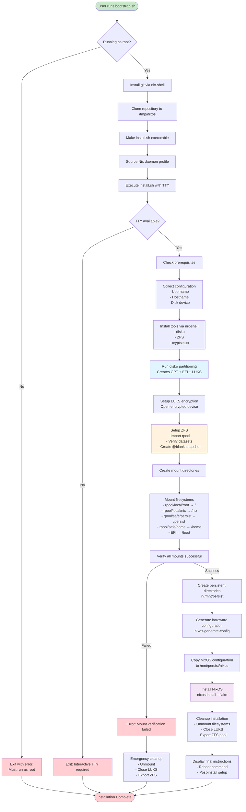
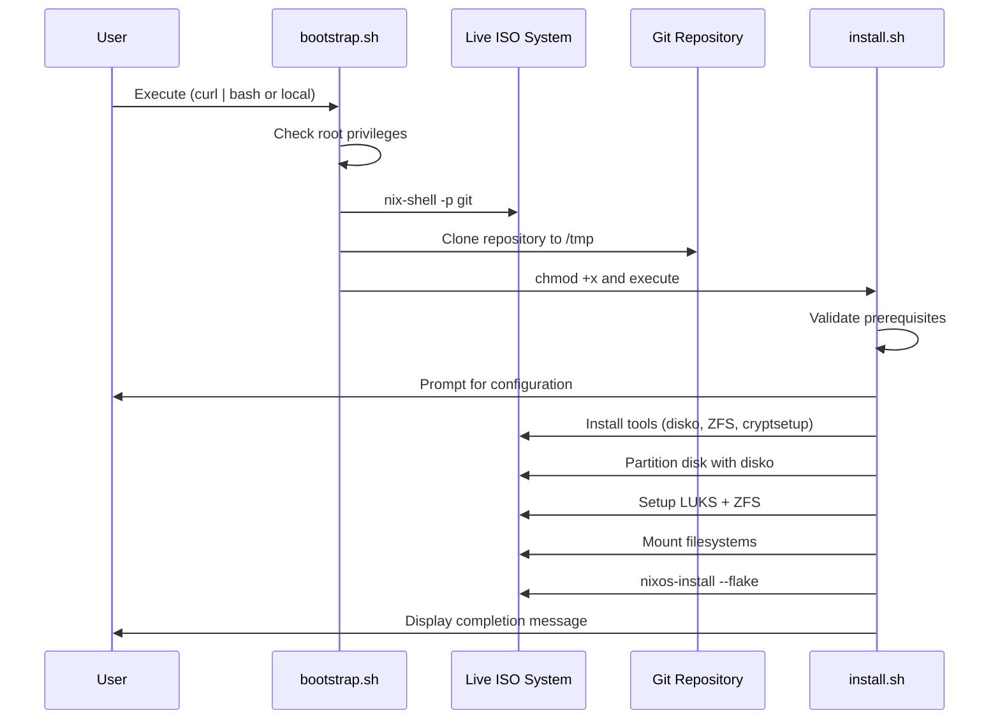
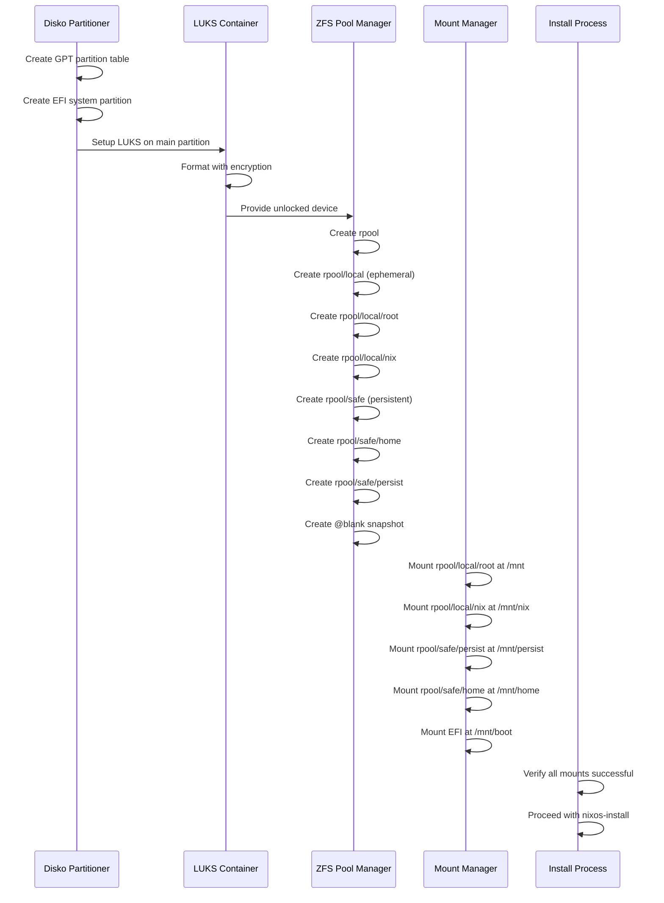

# NixOS Installation Scripts Analysis

This document provides a comprehensive analysis of the `bootstrap.sh` and `install.sh` scripts used for automated NixOS installation with disko, ZFS, and impermanence configuration.

## Overview

The installation process consists of two main scripts that work together to provide a complete, automated NixOS installation from a live ISO:

1. **`bootstrap.sh`** - Quick bootstrap script for initial setup and repository cloning
2. **`install.sh`** - Comprehensive installation script handling the complete system setup

## Bootstrap.sh Analysis

### Purpose
The `bootstrap.sh` script serves as an entry point for NixOS installation that can be executed directly from the web or downloaded locally. It handles the initial setup and hands off control to the main installation script.

### Key Features
- **Web-executable**: Can be run directly via `curl -L https://raw.githubusercontent.com/hbohlen/nixos/main/scripts/bootstrap.sh | bash`
- **Root privilege verification**: Ensures the script runs as root (required for system installation)
- **Repository cloning**: Downloads the complete NixOS configuration from GitHub
- **Environment setup**: Prepares the Nix environment for the installation process

### Workflow
1. **Privilege Check**: Verifies the script is running as root, exits if not
2. **Git Installation**: Uses `nix-shell -p git` to ensure git is available
3. **Repository Cloning**: 
   - Cleans up any existing `/tmp/nixos` directory
   - Clones the repository to `/tmp/nixos`
   - Changes to the repository directory
4. **Script Preparation**: Makes the install script executable
5. **Environment Setup**: Sources the Nix daemon profile if available
6. **Handoff**: Executes the main installation script with proper TTY inheritance

### Error Handling
- Simple error handling with colored output functions
- Strict error mode with `set -euo pipefail`
- Clear error messages for common issues (not running as root)

## Install.sh Analysis

### Purpose
The `install.sh` script is a comprehensive installation automation tool that handles the complete NixOS setup process, including disk partitioning, ZFS configuration, LUKS encryption, and system installation.

### Architecture Overview
The script follows a modular design with distinct phases:
1. **Prerequisites and Validation**
2. **Configuration Collection**  
3. **Tool Installation**
4. **Disk Setup (disko + ZFS + LUKS)**
5. **Filesystem Mounting**
6. **System Installation**
7. **Cleanup and Finalization**

### Key Functions

#### Configuration Management
```bash
# Global configuration variables
readonly HOSTNAME="desktop"
readonly DEFAULT_USERNAME="hbohlen" 
readonly DEFAULT_DISK_DEVICE="/dev/nvme0n1"
readonly MOUNT_POINT="/mnt"

# Dynamic configuration collection
collect_configuration()  # Prompts for user input and validates settings
```

#### Error Handling and Recovery
```bash
handle_error()          # Central error handler with cleanup
cleanup_on_error()      # Comprehensive cleanup (unmount, close LUKS, export ZFS)
trap 'handle_error ...' # Global error trap for unexpected failures
```

#### Prerequisite Validation
```bash
check_root()            # Verify root privileges
check_tty()             # Ensure interactive TTY access
check_prerequisites()   # Validate environment and required tools
install_tools()         # Install disko, ZFS, cryptsetup via nix-shell
```

#### Disk Setup Functions
```bash
run_disko()             # Execute disko partitioning with LUKS
setup_luks()            # Open LUKS container
setup_zfs()             # Import ZFS pool and verify datasets
```

#### Filesystem Management  
```bash
create_mount_directories()  # Create mount point structure
mount_filesystems()         # Mount all ZFS datasets and boot partition
verify_mounts()             # Validate all mounts are successful
```

#### System Installation
```bash
create_persistent_directories()  # Setup persistence directories
generate_hardware_config()      # Generate NixOS hardware configuration
copy_configuration()            # Copy repo to persistent storage
install_nixos()                # Run nixos-install with flake configuration
```

## Disko Integration and ZFS Setup

### Disko Configuration Process
The script uses disko for declarative disk partitioning with the following workflow:

1. **Dynamic Script Generation**: Creates a temporary disko execution script with proper TTY handling
2. **Configuration Selection**: Uses host-specific disko configuration from `./hosts/$HOSTNAME/hardware/disko-layout.nix`
3. **Partition Layout**: Creates three main partitions:
   - **ESP/Boot** (1GB vfat): EFI system partition
   - **Swap** (8-16GB): Encrypted swap partition  
   - **LUKS** (remaining space): Encrypted container for ZFS

### ZFS Pool Structure
The ZFS setup creates a hierarchical dataset structure:

```
rpool (encrypted ZFS pool)
├── local/          # Ephemeral datasets
│   ├── root        # Root filesystem (ephemeral, rolled back on boot)
│   └── nix         # Nix store (persistent for performance)
└── safe/           # Persistent datasets
    ├── persist     # System-wide persistent data
    └── home        # User home directories
```

### ZFS Configuration Features
- **Compression**: zstd compression for space efficiency
- **Record Size Optimization**:
  - `1M` for system files and nix store (large files)
  - `128K` for user data (mixed workload)
- **Snapshot Creation**: Automatic blank snapshot for impermanence rollback
- **Performance Settings**: ashift=12, autotrim=on for SSD optimization

## Impermanence Configuration and Persistence Setup

### Impermanence Concept
The system implements "impermanence" where the root filesystem is ephemeral - it's reset to a clean state on every boot. Only explicitly configured files and directories persist across reboots.

### Persistence Mechanism
- **Ephemeral Root**: `/` is mounted from `rpool/local/root` and rolled back to `@blank` snapshot
- **Persistent Storage**: `/persist` mounted from `rpool/safe/persist` dataset
- **Bind Mounts**: Impermanence module creates bind mounts from `/persist` to system locations

### Directory Structure Created
```
/persist/
├── etc/               # System configuration files
├── var/
│   ├── log/          # System logs
│   ├── lib/          # System state
│   │   ├── nixos/    # NixOS state
│   │   └── systemd/  # systemd state
│   └── ...
├── root/             # Root user home
└── home/
    └── $USERNAME/    # User-specific persistent data
        ├── .ssh/     # SSH keys
        ├── .config/  # User configuration
        ├── .local/   # Local application data
        └── Development/  # Development files
```

### Impermanence Module Integration
The system uses the impermanence NixOS module which:
- Handles bind mounting of persistent directories
- Manages file permissions and ownership
- Provides ZFS rollback service in initrd
- Ensures proper boot order with systemd

## Script Relationship and Dependencies

### Execution Flow
```
bootstrap.sh (entry point)
    ↓
├─ Git installation & repository cloning
├─ Environment preparation  
    ↓
install.sh (main installation)
    ↓
├─ Prerequisites validation
├─ User configuration collection
├─ Tool installation (disko, ZFS, cryptsetup)
├─ Disk partitioning (disko)
├─ LUKS encryption setup
├─ ZFS pool and dataset creation
├─ Filesystem mounting
├─ Persistent directory creation
├─ NixOS configuration copying
├─ System installation (nixos-install)
└─ Cleanup and finalization
```

### Dependencies
- **bootstrap.sh dependencies**:
  - curl/wget (for web execution)
  - NixOS live ISO environment
  - Internet connectivity
  - Root privileges

- **install.sh dependencies**:
  - Nix with flakes support
  - Git (for repository access)
  - disko (installed via nix-shell)
  - ZFS utilities (zpool, zfs)
  - cryptsetup (for LUKS)
  - nixos-generate-config
  - nixos-install

### Inter-script Communication
- **Environment Variables**: Shared through shell environment
- **File System**: Repository cloned to `/tmp/nixos` by bootstrap
- **TTY Inheritance**: Proper terminal access maintained throughout

## Error Handling and Recovery Mechanisms

### Multi-layered Error Handling
1. **Global Error Trap**: `trap 'handle_error ...' ERR` catches all unexpected errors
2. **Function-level Validation**: Each major function validates its prerequisites  
3. **Resource Cleanup**: Comprehensive cleanup on any failure
4. **User Feedback**: Clear error messages with suggested remediation

### Recovery Procedures
- **Filesystem Cleanup**: Automatic unmounting of all mounted filesystems
- **LUKS Container**: Automatic closure of LUKS containers
- **ZFS Pool**: Automatic export of imported ZFS pools
- **Temporary Files**: Cleanup of temporary scripts and files

### Validation Steps
- **Disk Existence**: Validates target disk device exists
- **Mount Points**: Verifies all filesystems mount successfully
- **ZFS Datasets**: Confirms all required datasets are created
- **Configuration**: Validates host configuration files exist

## Installation Process Summary

The complete installation process follows this high-level workflow:

1. **Bootstrap Phase** (bootstrap.sh):
   - Verify root access
   - Install git and clone repository
   - Prepare environment for main installation

2. **Preparation Phase** (install.sh):
   - Validate prerequisites and environment
   - Collect user configuration (username, disk device)
   - Install required tools (disko, ZFS, cryptsetup)

3. **Disk Setup Phase**:
   - Run disko to partition disk and setup LUKS
   - Import ZFS pool and verify datasets
   - Create blank snapshot for impermanence

4. **Filesystem Phase**:
   - Mount all ZFS datasets and boot partition
   - Verify all mount points
   - Create persistent directory structure

5. **Installation Phase**:
   - Generate hardware configuration
   - Copy NixOS configuration to persistent storage
   - Install NixOS with flake configuration

6. **Finalization Phase**:
   - Cleanup temporary resources
   - Provide post-installation instructions
   - Prepare system for first boot

This design provides a robust, automated installation process that creates a modern NixOS system with ephemeral root, encrypted storage, and declarative configuration management.

## Installation Workflow Diagram

### Complete Installation Process Flow



### Bootstrap vs Install Script Relationship



### ZFS Dataset Creation and Mount Sequence

