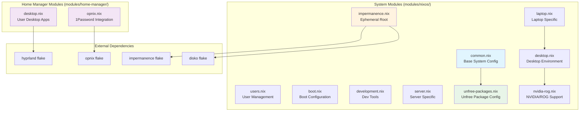

# NixOS Configuration Modules Reference

This directory contains comprehensive documentation for all modules in the NixOS configuration system.

## Module Overview

The NixOS configuration uses a modular architecture with reusable components organized into two main categories:

### System Modules (`modules/nixos/`)
- **[common.nix](./nixos/common.md)** - Base system configuration, packages, and global settings
- **[boot.nix](./nixos/boot.md)** - Boot loader configuration and kernel parameters
- **[users.nix](./nixos/users.md)** - User account management with SSH key support
- **[impermanence.nix](./nixos/impermanence.md)** - Ephemeral root filesystem with selective persistence
- **[development.nix](./nixos/development.md)** - Development tools and programming environments
- **[desktop.nix](./nixos/desktop.md)** - Desktop environment and GUI applications
- **[laptop.nix](./nixos/laptop.md)** - Laptop-specific power management and hardware optimizations
- **[server.nix](./nixos/server.md)** - Server hardening, monitoring, and security
- **[nvidia-rog.nix](./nixos/nvidia-rog.md)** - NVIDIA graphics and ASUS ROG hardware support
- **[unfree-packages.nix](./nixos/unfree-packages.md)** - Centralized unfree package allowlist

### Home Manager Modules (`modules/home-manager/`)
- **[desktop.nix](./home-manager/desktop.md)** - User desktop environment with Hyprland
- **[opnix.nix](./home-manager/opnix.md)** - 1Password secret management integration

## Module Dependencies



## Module Usage Patterns

### Host Type Modules
Different host types import different combinations of modules:

**Desktop Configuration:**
```nix
imports = [
  ../../modules/nixos/common.nix
  ../../modules/nixos/boot.nix
  ../../modules/nixos/users.nix
  ../../modules/nixos/impermanence.nix
  ../../modules/nixos/development.nix
  ../../modules/nixos/desktop.nix
  ../../modules/nixos/nvidia-rog.nix  # If applicable
];
```

**Laptop Configuration:**
```nix
imports = [
  ../../modules/nixos/common.nix
  ../../modules/nixos/boot.nix
  ../../modules/nixos/users.nix
  ../../modules/nixos/impermanence.nix
  ../../modules/nixos/development.nix
  ../../modules/nixos/desktop.nix
  ../../modules/nixos/laptop.nix
];
```

**Server Configuration:**
```nix
imports = [
  ../../modules/nixos/common.nix
  ../../modules/nixos/boot.nix
  ../../modules/nixos/users.nix
  ../../modules/nixos/impermanence.nix
  ../../modules/nixos/server.nix
];
```

## Configuration Guidelines

### Module Options
All modules follow NixOS module conventions:
- Use `lib.mkOption` for configurable parameters
- Provide `lib.mkDefault` for overridable defaults
- Use `lib.mkIf` for conditional configuration
- Include comprehensive descriptions for all options

### Security Considerations
- **Never commit secrets** - Use runtime secret injection via Opnix/1Password
- Test configurations with `nixos-rebuild build` before switching
- Review security implications of module combinations
- Use module enable options for conditional functionality

### Best Practices
- Keep modules focused and single-purpose
- Use proper option types and validation
- Provide sensible defaults for all options
- Test modules across multiple host types
- Document module interdependencies
- Use relative imports for maximum portability

## Quick Reference

| Module | Purpose | Host Types | Key Options |
|--------|---------|------------|-------------|
| common.nix | Base system setup | All | `common.timezone` |
| users.nix | User management | All | `users.hostType`, `users.sshKeys` |
| desktop.nix | GUI environment | Desktop, Laptop | `desktop.enable`, `desktop.environment` |
| laptop.nix | Power management | Laptop | Auto-enabled via imports |
| server.nix | Security hardening | Server | Auto-configured |
| development.nix | Dev tools | Desktop, Laptop | `development.enable` |
| impermanence.nix | Ephemeral root | All | Persistence configuration |

For detailed configuration examples and options, see the individual module documentation files.