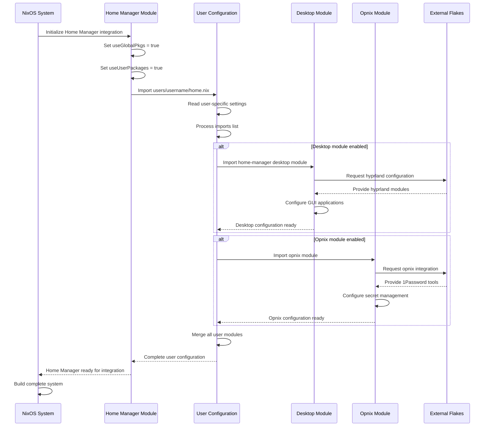
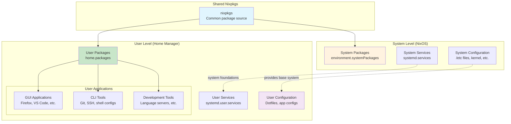

# Home Manager Modules Documentation

This directory contains documentation for Home Manager modules that provide declarative user environment management within the NixOS configuration system.

## Overview

Home Manager modules handle user-specific configurations including desktop applications, development tools, shell configurations, and user services. These modules integrate seamlessly with the NixOS system configuration to provide a complete declarative system.

## Available Modules

| Module | Purpose | Dependencies |
|--------|---------|--------------|
| [desktop.nix](desktop.md) | Desktop applications and GUI tools | hyprland flake |
| [opnix.nix](opnix.md) | 1Password secrets integration | opnix flake |

## Home Manager Integration Architecture

### Integration Flow with NixOS System

```mermaid
flowchart TD
    Start([NixOS System Build]) --> ReadFlake[flake.nix processes inputs]
    ReadFlake --> MkSystem[mkSystem helper function called<br/>with hostname & username]
    
    MkSystem --> LoadNixOS[Load NixOS system modules<br/>hosts/hostname/default.nix]
    LoadNixOS --> ConfigureHM[Configure Home Manager integration]
    
    ConfigureHM --> SetGlobal[Set useGlobalPkgs = true<br/>Share nixpkgs with system]
    SetGlobal --> SetUserPkgs[Set useUserPackages = true<br/>Install packages to user profile]
    SetUserPkgs --> LoadUserConfig[Load user configuration<br/>users/username/home.nix]
    
    LoadUserConfig --> PassArgs[Pass specialArgs to HM<br/>inputs, hostname, username]
    PassArgs --> ProcessUserModules[Process Home Manager modules]
    
    ProcessUserModules --> LoadDesktop{Desktop module enabled?}
    LoadDesktop -->|Yes| ConfigDesktop[Configure desktop applications<br/>GUI tools, themes, etc.]
    LoadDesktop -->|No| CheckOpnix
    ConfigDesktop --> CheckOpnix
    
    CheckOpnix{Opnix module enabled?}
    CheckOpnix -->|Yes| ConfigOpnix[Configure 1Password integration<br/>SSH keys, secrets, etc.]
    CheckOpnix -->|No| CheckMoreModules
    ConfigOpnix --> CheckMoreModules
    
    CheckMoreModules{More HM modules?}
    CheckMoreModules -->|Yes| ProcessUserModules
    CheckMoreModules -->|No| MergeConfig[Merge user configuration<br/>with system configuration]
    
    MergeConfig --> ValidateHM[Validate Home Manager config<br/>Check for conflicts]
    ValidateHM -->|Failed| HMError[Home Manager Error<br/>Exit with detailed message]
    ValidateHM -->|Success| BuildSystem[Build complete system<br/>NixOS + Home Manager]
    
    BuildSystem --> ActivateSystem[Activate system configuration]
    ActivateSystem --> ActivateHM[Activate Home Manager<br/>for specified user]
    ActivateHM --> Complete([System + User Environment Ready])
    
    HMError --> End([Exit with error])
    Complete --> End
    
    %% Styling
    style Start fill:#c8e6c9
    style Complete fill:#c8e6c9
    style End fill:#ffecb3
    style HMError fill:#ffcdd2
    style LoadUserConfig fill:#e1f5fe
    style ConfigDesktop fill:#fff3e0
    style ConfigOpnix fill:#f3e5f5
    style BuildSystem fill:#e8f5e8
```

### User Configuration Loading Process

### Package Management Integration

## Configuration Guidelines

### Best Practices

- **Modular Design**: Keep Home Manager modules focused on specific functionality
- **User-Specific**: Home Manager modules should only configure user-level settings
- **Coordination**: Coordinate with system modules for services that span both levels
- **Testing**: Use `home-manager build` to test configurations before switching

### Security Considerations

- Home Manager configurations have access to user data and credentials
- Use the opnix module for secure secret management
- Avoid hardcoding sensitive information in configurations
- Test user configurations in isolation when possible

### Module Development

When creating new Home Manager modules:

1. Follow the existing module patterns in this repository
2. Use proper option declarations with types and descriptions  
3. Integrate with external flakes when appropriate
4. Document module options and usage examples
5. Test across different host configurations

## Quick Reference

For detailed information about specific modules, see the individual documentation files:

- **Desktop Applications**: [desktop.md](desktop.md)
- **Secret Management**: [opnix.md](opnix.md)

For general Home Manager usage and options, refer to the [official Home Manager manual](https://nix-community.github.io/home-manager/).