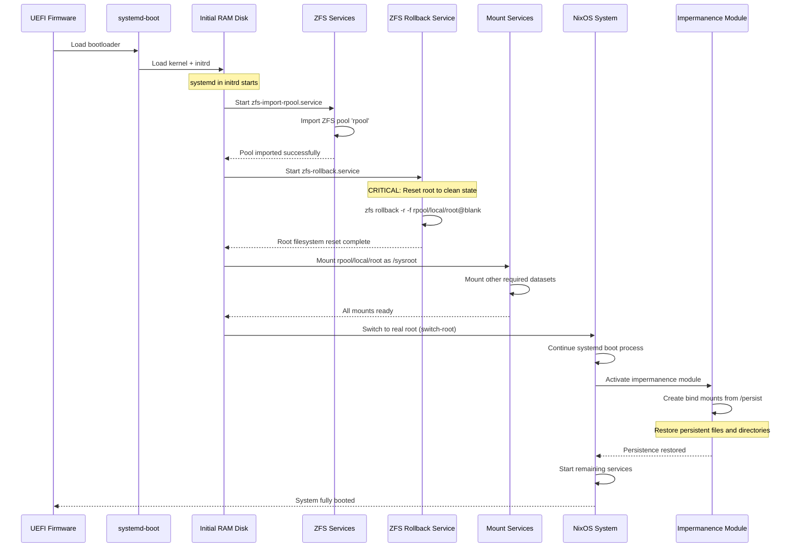
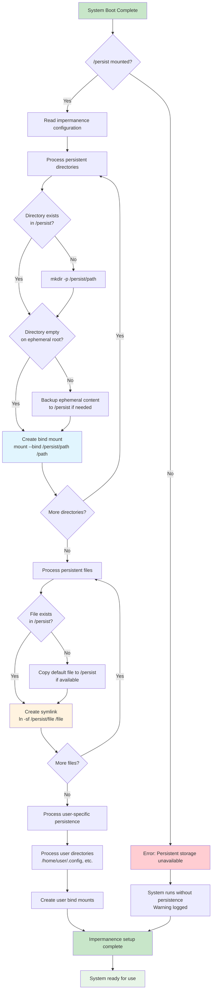

# impermanence.nix - Ephemeral Root Filesystem

**Location:** `modules/nixos/impermanence.nix`

## Purpose

Implements ephemeral root filesystem using ZFS snapshots with selective persistence. The root filesystem is reset to a blank state on every boot, while specific files and directories are preserved on a persistent ZFS dataset.

## Dependencies

- **External Flakes:** `inputs.impermanence.nixosModules.impermanence`
- **Filesystems:** ZFS with specific pool structure (`rpool`)
- **Variables:** Requires `username` parameter from host configuration
- **Boot System:** Works with systemd in initrd for proper service ordering

## Architecture

### ZFS Pool Structure
```
rpool/
├── local/
│   ├── root         # Ephemeral root (rollback on boot)
│   └── nix          # Nix store (persistent)
└── safe/
    ├── persist      # Persistent data
    └── home         # User home directories
```

### Filesystem Layout
```nix
fileSystems = {
  "/" = {
    device = "rpool/local/root";
    fsType = "zfs";
  };
  "/nix" = {
    device = "rpool/local/nix";
    fsType = "zfs";
    neededForBoot = true;
  };
  "/persist" = {
    device = "rpool/safe/persist";
    fsType = "zfs";
    neededForBoot = true;
  };
  "/home" = {
    device = "rpool/safe/home";
    fsType = "zfs";
  };
  "/boot" = {
    device = "/dev/disk/by-partlabel/disk-main-ESP";
    fsType = "vfat";
    options = [ "umask=0077" ];
    neededForBoot = true;
  };
};
```

### ZFS Pool Structure and Hierarchy

```mermaid
graph TB
    subgraph "Physical Storage"
        Disk["/dev/nvme0n1 (or target disk)"]
        LUKS[LUKS Encryption Layer<br/>cryptsetup]
        
        Disk --> LUKS
    end
    
    subgraph "ZFS Pool: rpool"
        Pool[rpool<br/>ZFS Pool Root]
        
        subgraph "local (Ephemeral Data)"
            Local[rpool/local<br/>Non-persistent datasets]
            Root[rpool/local/root<br/>Root filesystem /]
            Nix[rpool/local/nix<br/>Nix store /nix]
            
            Local --> Root
            Local --> Nix
        end
        
        subgraph "safe (Persistent Data)"  
            Safe[rpool/safe<br/>Persistent datasets]
            Persist[rpool/safe/persist<br/>System persistence /persist]
            Home[rpool/safe/home<br/>User home /home]
            
            Safe --> Persist
            Safe --> Home
        end
        
        Pool --> Local
        Pool --> Safe
    end
    
    subgraph "Mount Points"
        MountRoot[/ → rpool/local/root]
        MountNix[/nix → rpool/local/nix] 
        MountPersist[/persist → rpool/safe/persist]
        MountHome[/home → rpool/safe/home]
        MountBoot[/boot → EFI partition]
    end
    
    LUKS --> Pool
    Root --> MountRoot
    Nix --> MountNix
    Persist --> MountPersist
    Home --> MountHome
    
    %% Styling
    style Root fill:#ffcdd2
    style Nix fill:#ffcdd2  
    style Persist fill:#c8e6c9
    style Home fill:#c8e6c9
    style Pool fill:#e1f5fe
```

### Boot Process with Impermanence Flow



## Features

### Ephemeral Root Rollback

#### ZFS Rollback Service
```nix
boot.initrd.systemd.services.zfs-rollback = {
  description = "Rollback ZFS root dataset to a blank snapshot";
  wantedBy = [ "initrd.target" ];
  after = [ "zfs-import-rpool.service" ];
  before = [ "sysroot.mount" ];
  path = [ pkgs.zfs ];
  serviceConfig.Type = "oneshot";
  unitConfig.DefaultDependencies = "no";
  script = "zfs rollback -r -f rpool/local/root@blank";
};
```

The rollback service:
- Runs during initrd stage (before root filesystem mount)
- Requires ZFS pool to be imported first
- Recursively rolls back to `@blank` snapshot
- Ensures clean state on every boot

### Impermanence Bind Mount Process



### Persistence Configuration

#### System-Level Persistence
```nix
environment.persistence."/persist" = {
  hideMounts = true;
  directories = [
    "/var/log"                          # System logs
    "/var/lib/nixos"                    # NixOS state
    "/var/lib/systemd/coredump"         # Core dumps
    "/var/lib/AccountsService"          # User accounts
    "/etc/NetworkManager/system-connections"  # Network configs
    "/var/lib/colord"                   # Color profiles
    "/var/lib/flatpak"                  # Flatpak applications
    "/var/lib/1password"                # 1Password system data
    "/etc/asusd"                        # ASUS daemon config
    "/var/lib/asusd"                    # ASUS daemon data
  ];
  
  files = [
    "/etc/machine-id"                   # Unique machine identifier
    "/etc/ssh/ssh_host_ed25519_key"     # SSH host keys
    "/etc/ssh/ssh_host_ed25519_key.pub"
    "/etc/ssh/ssh_host_rsa_key"
    "/etc/ssh/ssh_host_rsa_key.pub"
  ];
};
```

#### User-Level Persistence
```nix
users.${username} = {
  directories = [
    # Essential user directories
    ".ssh"                              # SSH keys and config
    ".gnupg"                            # GPG keys
    
    # 1Password user data
    ".config/op"
    ".config/1Password"
    ".cache/1Password"
    
    # Development tools
    ".config/git"
    ".config/gh"                        # GitHub CLI
    ".local/share/zsh"                  # Shell history
    ".cache"                            # General cache
    ".local/state"                      # Application state
    
    # User data
    "Documents"
    "Downloads"
    "Pictures"
    "Music"
    "Videos"
    ".local/share"
    
    # Development caches (optional)
    ".cargo"                            # Rust
    ".npm"                              # Node.js
    "Development"                       # Projects
  ];
  
  files = [
    ".bash_history"
    ".zsh_history"
    ".gitconfig"
    ".gitconfig.local"
  ];
};
```

### Security and Permissions

#### SSH Key Permission Fix
```nix
system.activationScripts.fixSSHPermissions = {
  text = ''
    # Ensure SSH host keys have correct permissions
    if [ -d "/persist/etc/ssh" ]; then
      chown -R root:root /persist/etc/ssh
      chmod 755 /persist/etc/ssh
      chmod 600 /persist/etc/ssh/ssh_host_*_key
      chmod 644 /persist/etc/ssh/ssh_host_*_key.pub
    fi
    
    # Ensure user SSH directory has correct permissions
    if [ -d "/persist/home/${username}/.ssh" ]; then
      chown -R ${username}:${username} /persist/home/${username}/.ssh
      chmod 700 /persist/home/${username}/.ssh
      chmod 600 /persist/home/${username}/.ssh/id_*
      chmod 644 /persist/home/${username}/.ssh/id_*.pub
      chmod 644 /persist/home/${username}/.ssh/authorized_keys
      chmod 644 /persist/home/${username}/.ssh/known_hosts*
    fi
  '';
  deps = [ "users" ];
};
```

### Boot Configuration

#### SystemD InitRD Settings
```nix
boot.initrd.systemd.enable = true;
boot.initrd.systemd.settings.Manager = {
  DefaultTimeoutStartSec = "300s";
  DefaultTimeoutStopSec = "30s";
};
```

#### ZFS Support
```nix
boot.supportedFilesystems = [ "zfs" ];
services.zfs.autoScrub.enable = true;
```

## Usage Examples

### Basic Setup
```nix
{ config, lib, pkgs, inputs, username, ... }:
{
  imports = [
    ../../modules/nixos/impermanence.nix
  ];
  
  # Module automatically configures impermanence
  # Requires ZFS pool structure to be set up via disko
}
```

### Adding Custom Persistence
```nix
{ config, lib, pkgs, inputs, username, ... }:
{
  imports = [
    ../../modules/nixos/impermanence.nix
  ];
  
  # Add application-specific persistence
  environment.persistence."/persist" = {
    directories = [
      "/var/lib/postgresql"       # Database data
      "/var/lib/redis"           # Redis data
      "/etc/wireguard"           # VPN configuration
    ];
    
    files = [
      "/etc/nix/nix.conf"        # Custom Nix config
    ];
    
    users.${username} = {
      directories = [
        ".config/VSCode"         # Editor settings
        ".mozilla"               # Browser data
        ".local/share/Steam"     # Game data
      ];
    };
  };
}
```

### Development Environment
```nix
{ config, lib, pkgs, inputs, username, ... }:
{
  imports = [
    ../../modules/nixos/impermanence.nix
  ];
  
  # Persist development tools and projects
  environment.persistence."/persist".users.${username} = {
    directories = [
      # Development environments
      ".vscode"
      ".docker"
      ".kube"
      
      # Language-specific caches
      ".rustup"
      ".gradle"
      ".m2"                     # Maven
      
      # Project directories
      "workspace"
      "repositories"
      "src"
    ];
    
    files = [
      ".npmrc"
      ".cargo/credentials.toml"
    ];
  };
}
```

## Advanced Configuration

### Custom ZFS Snapshots
```bash
# Create initial blank snapshot (run once after OS installation)
zfs snapshot rpool/local/root@blank

# Create additional snapshots for rollback points
zfs snapshot rpool/local/root@pre-update
zfs snapshot rpool/local/root@working-state

# Manual rollback to specific snapshot
zfs rollback rpool/local/root@working-state
```

### Selective Directory Persistence
```nix
# Persist only specific subdirectories
environment.persistence."/persist".users.${username} = {
  directories = [
    {
      directory = ".config";
      user = username;
      group = username;
      mode = "0755";
    }
    {
      directory = ".local/share/applications";
      user = username;
      group = username;
      mode = "0755";
    }
  ];
};
```

### Emergency Recovery
```nix
# Boot with impermanence disabled for recovery
boot.kernelParams = [
  "systemd.mask=zfs-rollback.service"
];
```

## Troubleshooting

### Boot Issues

#### ZFS Pool Import Failures
```bash
# Check pool status
zpool status rpool

# Force import if necessary
zpool import -f rpool

# Check for corruption
zpool scrub rpool
```

#### Rollback Service Failures
```bash
# Check service status
systemctl status zfs-rollback

# Manual rollback during emergency boot
zfs rollback -r -f rpool/local/root@blank
```

### Persistence Issues

#### Missing Directories
```bash
# Check if persistence is working
ls -la /persist

# Verify bind mounts
mount | grep persist

# Check impermanence service
systemctl status persist-*
```

#### Permission Problems
```bash
# Fix SSH permissions manually
sudo chown -R root:root /persist/etc/ssh
sudo chmod 600 /persist/etc/ssh/ssh_host_*_key

# Fix user permissions
sudo chown -R ${username}:${username} /persist/home/${username}
```

### Data Recovery

#### Accessing Previous State
```bash
# List available snapshots
zfs list -t snapshot

# Access data from previous snapshot
zfs clone rpool/local/root@previous-snapshot rpool/recovery
mkdir /mnt/recovery
mount -t zfs rpool/recovery /mnt/recovery
```

#### Backup Important Data
```bash
# Create backup before major changes
zfs snapshot rpool/safe/persist@backup-$(date +%Y%m%d)
zfs snapshot rpool/safe/home@backup-$(date +%Y%m%d)
```

## Performance Considerations

### ZFS Settings
```nix
# Optimize ZFS for SSD
boot.kernelParams = [
  "zfs.zfs_arc_max=8589934592"    # 8GB ARC limit
];

# Dataset-specific settings
services.zfs.extraPools = [ "rpool" ];
```

### Storage Usage
- **Root dataset:** Minimal usage due to ephemeral nature
- **Persist dataset:** Grows with application data
- **Home dataset:** User data storage
- **Nix dataset:** Package store (can be large)

## Security Benefits

### Attack Surface Reduction
- **Malware persistence:** Eliminated through root rollback
- **System contamination:** Cleaned on every boot
- **Configuration drift:** Prevented by declarative config

### Data Protection
- **Accidental changes:** Reversible through snapshots
- **System corruption:** Recoverable from clean state
- **Selective exposure:** Only necessary data persists

## Integration Notes

### With Disko
The impermanence module requires disk layout configured via disko:
- Must create ZFS pool with proper structure
- Requires `@blank` snapshot on root dataset
- Boot partition must be properly configured

### With Other Modules
- **SSH (common.nix):** Host keys automatically persisted
- **Users (users.nix):** SSH keys and user data persisted
- **Desktop modules:** Application data selectively persisted
- **Development modules:** Tool caches and projects persisted

### With Backup Systems
```nix
# Backup persistent data regularly
services.zfsAutoSnapshot = {
  enable = true;
  frequent = 4;    # 15-minute snapshots, keep 4
  hourly = 24;     # Hourly snapshots, keep 24
  daily = 7;       # Daily snapshots, keep 7
  weekly = 4;      # Weekly snapshots, keep 4
  monthly = 12;    # Monthly snapshots, keep 12
};
```

## Migration Guide

### From Traditional Filesystem
1. **Backup data:** Create full system backup
2. **Install NixOS:** With disko ZFS configuration
3. **Create blank snapshot:** `zfs snapshot rpool/local/root@blank`
4. **Configure persistence:** Add necessary directories/files
5. **Restore data:** Copy to `/persist` directories
6. **Test rollback:** Reboot and verify functionality

### Adding New Persistent Data
1. **Identify requirements:** What needs to survive reboots
2. **Add to configuration:** Update persistence settings
3. **Rebuild system:** Apply new configuration
4. **Copy existing data:** Move to persistent location if needed