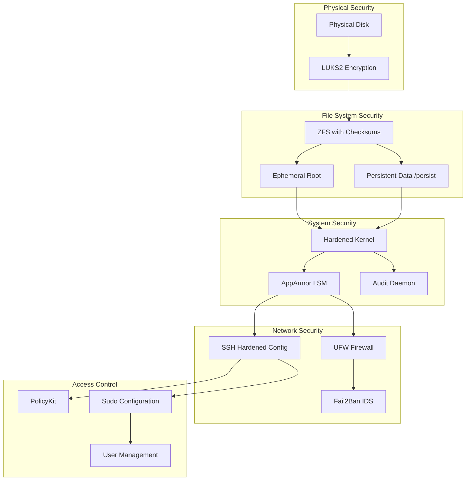

# NixOS Security Guide

This comprehensive security guide documents the security features, configurations, and best practices implemented in this NixOS configuration. The system employs multiple layers of security including full-disk encryption, ephemeral root filesystem, SSH hardening, and kernel-level protections.

## Table of Contents

- [Security Architecture Overview](#security-architecture-overview)
- [LUKS Full-Disk Encryption](#luks-full-disk-encryption)
- [SSH Configuration and Key Management](#ssh-configuration-and-key-management)
- [Impermanence Security Benefits](#impermanence-security-benefits)
- [System Hardening](#system-hardening)
- [Secure Boot Configuration](#secure-boot-configuration)
- [Network Security](#network-security)
- [Access Control and Permissions](#access-control-and-permissions)
- [Security Monitoring and Logging](#security-monitoring-and-logging)
- [Best Practices and Recommendations](#best-practices-and-recommendations)
- [Security Checklist](#security-checklist)
- [Incident Response](#incident-response)

## Security Architecture Overview

This NixOS configuration implements a defense-in-depth security strategy with multiple layers of protection:



### Core Security Principles

1. **Principle of Least Privilege**: Users and processes have minimal necessary permissions
2. **Defense in Depth**: Multiple security layers protect against different attack vectors
3. **Fail Secure**: System defaults to secure configurations when possible
4. **Auditability**: All security-relevant events are logged and monitored
5. **Immutability**: System state is reproducible and tamper-resistant

## LUKS Full-Disk Encryption

### Overview

The system uses LUKS2 (Linux Unified Key Setup) for full-disk encryption, providing confidentiality for data at rest. All user data, system files, and swap space are encrypted.

### Implementation Details

#### Disk Layout with LUKS

```
/dev/nvme0n1
├── /dev/nvme0n1p1  → /boot (FAT32, unencrypted)
├── /dev/nvme0n1p2  → swap (encrypted with random key)
└── /dev/nvme0n1p3  → LUKS container
    └── /dev/mapper/cryptroot → ZFS pool (rpool)
```

#### LUKS Configuration

The LUKS setup is defined in each host's `hardware/disko-layout.nix`:

```nix
luks = {
  size = "100%";
  content = {
    type = "luks";
    name = "cryptroot";
    settings = {
      allowDiscards = true;  # Enable TRIM for SSD performance
    };
    content = {
      type = "zfs";
      pool = "rpool";
    };
  };
};
```

#### Security Features

- **LUKS2 Format**: Uses modern LUKS2 with improved security features
- **PBKDF2 Key Derivation**: Strong password-based key derivation
- **Secure Key Storage**: Encryption keys are protected by strong passphrases
- **TRIM Support**: `allowDiscards = true` enables SSD TRIM while maintaining security
- **Random Swap Encryption**: Swap partitions use ephemeral random encryption keys

#### Key Management Best Practices

1. **Strong Passphrases**: Use long, complex passphrases (minimum 20+ characters)
2. **Key Backup**: Store recovery keys in secure offline locations
3. **Regular Key Rotation**: Consider periodic passphrase changes for high-security environments
4. **Hardware Security**: Consider FIDO2/YubiKey integration for additional factors

### Performance Considerations

- **AES-NI Support**: Modern CPUs provide hardware acceleration
- **Minimal Overhead**: Typically <5% performance impact on modern hardware
- **SSD Optimization**: TRIM support maintains SSD performance and lifespan

## SSH Configuration and Key Management

### SSH Hardening Configuration

The SSH server is configured with security-first settings in `modules/nixos/common.nix`:

```nix
services.openssh = {
  enable = true;
  settings = {
    PermitRootLogin = "no";           # Disable root login
    PasswordAuthentication = false;    # Force key-based auth
    UsePAM = true;                    # Enable PAM for additional controls
    X11Forwarding = false;            # Disable X11 forwarding
    AllowTcpForwarding = false;       # Disable TCP forwarding
    GatewayPorts = "no";              # Disable gateway ports
    PermitTunnel = "no";              # Disable tunneling
  };
  openFirewall = true;
};
```

### Key Management Strategy

#### SSH Key Types and Recommendations

| Key Type | Security Level | Use Case | Key Size |
|----------|---------------|----------|----------|
| **Ed25519** | ⭐⭐⭐⭐⭐ | Preferred for all new keys | 256-bit |
| **RSA** | ⭐⭐⭐⭐ | Legacy compatibility | 4096-bit minimum |
| **ECDSA** | ⭐⭐⭐ | Not recommended | Various |

#### SSH Key Generation

Generate secure SSH keys:

```bash
# Ed25519 (recommended)
ssh-keygen -t ed25519 -C "username@hostname-$(date +%Y%m%d)"

# RSA 4096-bit (for compatibility)
ssh-keygen -t rsa -b 4096 -C "username@hostname-$(date +%Y%m%d)"
```

#### Host Key Management

SSH host keys are automatically generated and persisted in `/persist/etc/ssh/`:

```nix
files = [
  "/etc/ssh/ssh_host_ed25519_key"
  "/etc/ssh/ssh_host_ed25519_key.pub" 
  "/etc/ssh/ssh_host_rsa_key"
  "/etc/ssh/ssh_host_rsa_key.pub"
];
```

#### Permission Management

The system automatically sets correct SSH key permissions:

```nix
system.activationScripts.fixSSHPermissions = {
  text = ''
    # SSH host keys
    if [ -d "/persist/etc/ssh" ]; then
      chown -R root:root /persist/etc/ssh
      chmod 755 /persist/etc/ssh
      chmod 600 /persist/etc/ssh/ssh_host_*_key      # Private keys
      chmod 644 /persist/etc/ssh/ssh_host_*_key.pub  # Public keys
    fi
    
    # User SSH keys
    if [ -d "/persist/home/${username}/.ssh" ]; then
      chown -R ${username}:${username} /persist/home/${username}/.ssh
      chmod 700 /persist/home/${username}/.ssh
      chmod 600 /persist/home/${username}/.ssh/id_*           # Private keys
      chmod 644 /persist/home/${username}/.ssh/id_*.pub       # Public keys  
      chmod 644 /persist/home/${username}/.ssh/authorized_keys
      chmod 644 /persist/home/${username}/.ssh/known_hosts*
    fi
  '';
};
```

### SSH Security Best Practices

1. **Key-Only Authentication**: Password authentication is disabled system-wide
2. **Key Rotation**: Regularly rotate SSH keys (annually recommended)
3. **Key Passphrases**: Protect private keys with strong passphrases
4. **Agent Forwarding**: Avoid SSH agent forwarding in untrusted environments
5. **Connection Monitoring**: Monitor SSH connections via system logs

## Impermanence Security Benefits

### Ephemeral Root Filesystem

The impermanence setup provides significant security advantages by implementing an ephemeral root filesystem that resets to a clean state on every boot.

#### Architecture

```mermaid
graph LR
    subgraph "Boot Process"
        BOOT[Boot] --> ROLLBACK[ZFS Rollback]
        ROLLBACK --> BLANK[Clean Root State]
        BLANK --> MOUNT[Mount Persistent Data]
    end
    
    subgraph "File System Structure"
        ROOT[/ - Ephemeral Root]
        PERSIST[/persist - Persistent System Data] 
        HOME[/home - Persistent User Data]
        NIX[/nix - Immutable Nix Store]
        
        MOUNT --> ROOT
        MOUNT --> PERSIST  
        MOUNT --> HOME
        MOUNT --> NIX
    end
```

#### Security Benefits

1. **Malware Resistance**
   - Any malware installed in the root filesystem is wiped on reboot
   - Persistent malware must explicitly target `/persist` or `/home` directories
   - System always starts from a known-clean state

2. **Attack Surface Reduction**
   - Temporary files and caches don't accumulate
   - System cruft is automatically cleaned
   - Reduces long-term persistence of security vulnerabilities

3. **Forensic Protection**
   - System activity traces are ephemeral
   - Reduces persistent evidence of user activity
   - Simplified incident response and recovery

4. **Configuration Drift Prevention**
   - System always matches declared configuration
   - Prevents unauthorized persistent changes
   - Easier to audit and verify system state

#### Implementation Details

The ephemeral root is implemented via ZFS rollback in initrd:

```nix
boot.initrd.systemd.services.zfs-rollback = {
  description = "Rollback ZFS root dataset to a blank snapshot";
  wantedBy = [ "initrd.target" ];
  after = [ "zfs-import-rpool.service" ];
  before = [ "sysroot.mount" ];
  path = [ pkgs.zfs ];
  serviceConfig.Type = "oneshot";
  unitConfig.DefaultDependencies = "no";
  script = "zfs rollback -r -f rpool/local/root@blank";
};
```

#### Persistent Data Management

Only explicitly declared directories and files persist across reboots:

```nix
environment.persistence."/persist" = {
  directories = [
    "/var/log"                    # System logs
    "/var/lib/nixos"              # NixOS state
    "/var/lib/systemd/coredump"   # Core dumps
    "/etc/NetworkManager/system-connections"  # Network configs
  ];
  
  files = [
    "/etc/machine-id"             # System identity
    "/etc/ssh/ssh_host_*_key"     # SSH host keys
  ];
  
  users.${username} = {
    directories = [
      ".ssh"                      # User SSH keys
      ".gnupg"                    # GPG keys
      "Documents"                 # User documents
      "Downloads"                 # Downloads
    ];
  };
};
```

## System Hardening

### Kernel Security Features

The system enables comprehensive kernel-level security hardening:

```nix
security = {
  # Privilege escalation control
  polkit.enable = true;
  
  # Mandatory Access Control
  apparmor.enable = true;
  
  # System activity monitoring
  auditd.enable = true;
  
  # Kernel protection
  protectKernelImage = true;
  lockKernelModules = true;
  
  # Memory protection
  unprivilegedUsernsClone = false;
  
  # CPU security
  allowSimultaneousMultithreading = false;
};
```

### Kernel Parameters

Security-focused kernel parameters are enabled:

```nix
boot.kernelParams = [
  "page_alloc.shuffle=1"    # Randomize memory allocations
  "slab_nomerge"            # Prevent heap overflow exploitation  
  "init_on_alloc=1"         # Zero memory on allocation
  "init_on_free=1"          # Zero memory on free
  "pti=on"                  # Page Table Isolation (Meltdown)
  "random.trust_cpu=on"     # Use CPU random number generator
  "random.trust_bootloader=on"  # Use bootloader entropy
  "iommu=pt"                # IOMMU pass-through mode
  "nosmt"                   # Disable Simultaneous Multi-Threading
];
```

### Security Features Explanation

#### AppArmor (Mandatory Access Control)
- Provides fine-grained access control for applications
- Prevents applications from accessing unauthorized resources
- Complements traditional UNIX permissions

#### Audit Daemon
- Records security-relevant system events
- Enables forensic analysis and compliance monitoring
- Logs authentication attempts, file access, and system changes

#### Memory Protection
- **SLAB Protection**: Prevents heap-based exploits
- **Memory Initialization**: Zeros sensitive data in memory
- **KASLR**: Kernel Address Space Layout Randomization
- **SMEP/SMAP**: Supervisor Mode Execution/Access Prevention

#### CPU Security Mitigations
- **PTI (Page Table Isolation)**: Mitigates Meltdown vulnerability
- **IOMMU**: Prevents DMA attacks
- **SMT Disabled**: Reduces side-channel attack surface

## Secure Boot Configuration

### Current Status

The current configuration uses traditional UEFI boot without Secure Boot enabled. This section documents how to implement Secure Boot for enhanced security.

### Secure Boot Implementation

#### Prerequisites

1. **UEFI Firmware**: System must support UEFI Secure Boot
2. **Custom Keys**: Generate or obtain signing keys
3. **Signed Bootloader**: Use signed systemd-boot or GRUB

#### Enable Secure Boot Support

Add to your host configuration:

```nix
# Enable Secure Boot support
boot.loader.systemd-boot.enable = true;
boot.loader.efi.canTouchEfiVariables = true;

# Install sbctl for key management
environment.systemPackages = with pkgs; [
  sbctl  # Secure Boot key management tool
];

# Optional: Enable TPM support
security.tpm2.enable = true;
```

#### Secure Boot Setup Process

1. **Generate Keys**:
   ```bash
   # Generate Secure Boot keys
   sudo sbctl create-keys
   
   # Enroll keys in firmware
   sudo sbctl enroll-keys -m
   ```

2. **Sign Boot Components**:
   ```bash
   # Sign the systemd-boot loader
   sudo sbctl sign -s /boot/EFI/systemd/systemd-bootx64.efi
   
   # Sign kernel and initrd
   sudo sbctl sign -s /boot/EFI/Linux/nixos-*.efi
   ```

3. **Enable Secure Boot**:
   - Reboot into UEFI firmware settings
   - Enable Secure Boot
   - Set to "Custom Mode" if available

#### Automated Signing

Configure automatic signing of boot components:

```nix
# Enable automatic kernel signing
boot.loader.systemd-boot.editor = false;
security.lockKernelModules = true;

# Custom activation script for signing
system.activationScripts.secureboot = ''
  if command -v sbctl >/dev/null 2>&1; then
    sbctl sign -s /boot/EFI/systemd/systemd-bootx64.efi 2>/dev/null || true
    for kernel in /boot/EFI/Linux/nixos-*.efi; do
      [ -f "$kernel" ] && sbctl sign -s "$kernel" 2>/dev/null || true
    done
  fi
'';
```

### TPM Integration

For enhanced security with TPM (Trusted Platform Module):

```nix
# Enable TPM support
security.tpm2 = {
  enable = true;
  abrmd.enable = true;
};

# LUKS TPM unlock (advanced configuration)
boot.initrd.luks.devices.cryptroot = {
  # Enable TPM-based unlock
  # Note: This requires careful setup and key management
};
```

## Network Security

### Firewall Configuration

Each host type has tailored firewall rules implemented via UFW (Uncomplicated Firewall):

#### Desktop Configuration
```nix
# Restrictive rules for desktop use
networking.firewall = {
  enable = true;
  allowedTCPPorts = [ 22 ];  # SSH only
  allowedUDPPorts = [ ];
  allowPing = false;         # Disable ping response
};
```

#### Laptop Configuration  
```nix
# Mobile-appropriate rules with VPN support
networking.firewall = {
  enable = true;
  allowedTCPPorts = [ 22 ];
  allowedUDPPorts = [ 51820 ]; # WireGuard VPN
  allowPing = true;             # Enable for connectivity testing
};
```

#### Server Configuration
```nix  
# Server-focused rules with service ports
networking.firewall = {
  enable = true;
  allowedTCPPorts = [ 22 80 443 ];  # SSH, HTTP, HTTPS
  allowedUDPPorts = [ ];
  allowPing = true;
};
```

### Network Security Features

1. **Default Deny**: All ports closed by default
2. **Service-Specific**: Only required ports are opened
3. **Protocol Filtering**: Separate TCP/UDP port management
4. **ICMP Control**: Configurable ping response

### Intrusion Detection

Consider adding Fail2Ban for automated intrusion prevention:

```nix
services.fail2ban = {
  enable = true;
  maxretry = 3;
  bantime = "1h";
  ignoreIP = [
    "127.0.0.1/8"
    "::1"
    # Add trusted IP ranges
  ];
};
```

## Access Control and Permissions

### User Management

User access is managed through NixOS declarative configuration:

```nix
users.users.${username} = {
  isNormalUser = true;
  extraGroups = [ 
    "wheel"        # sudo access
    "networkmanager"  # network configuration
    "audio"        # audio devices
    "video"        # video devices
  ];
  
  # SSH key authentication
  openssh.authorizedKeys.keys = [
    "ssh-ed25519 AAAAC3NzaC1lZDI1NTE5... username@hostname"
  ];
  
  # Disable password authentication
  hashedPassword = null;
  initialPassword = null;
};
```

### Sudo Configuration

Sudo access is configured through the wheel group:

```nix
security.sudo = {
  enable = true;
  wheelNeedsPassword = true;  # Require password for sudo
  execWheelOnly = true;       # Only wheel group can sudo
};
```

### PolicyKit (Polkit)

PolicyKit provides fine-grained privilege escalation:

```nix
security.polkit.enable = true;

# Custom polkit rules can be added
security.polkit.extraConfig = ''
  // Allow users in wheel group to manage systemd services
  polkit.addRule(function(action, subject) {
      if (action.id == "org.freedesktop.systemd1.manage-units" &&
          subject.isInGroup("wheel")) {
          return polkit.Result.YES;
      }
  });
'';
```

## Security Monitoring and Logging

### System Logging

Comprehensive logging is configured for security monitoring:

```nix
services.journald = {
  extraConfig = ''
    SystemMaxUse=1G          # Limit log size
    SystemKeepFree=2G        # Keep disk space free
    RuntimeMaxUse=256M       # Runtime logs size
    RuntimeKeepFree=512M     # Runtime free space
    MaxFileSec=1month        # Log retention period
  '';
};
```

### Audit Trail

The audit daemon logs security-relevant events:

```nix
security.auditd.enable = true;

# Custom audit rules can be added
security.audit.rules = [
  # Monitor authentication events
  "-w /etc/passwd -p wa -k identity"
  "-w /etc/group -p wa -k identity"
  "-w /etc/shadow -p wa -k identity"
  
  # Monitor privilege escalation
  "-a always,exit -F arch=b64 -S execve -F euid=0 -F auid!=0 -k privilege_escalation"
  
  # Monitor network configuration changes
  "-w /etc/NetworkManager/ -p wa -k network_config"
];
```

### Log Analysis

Regular log monitoring should include:

1. **Authentication Events**: SSH logins, sudo usage, failed authentications
2. **System Changes**: Package installations, configuration changes
3. **Network Activity**: Connection attempts, firewall events
4. **File Access**: Access to sensitive files and directories

### Security Monitoring Tools

Consider deploying additional monitoring:

```nix
environment.systemPackages = with pkgs; [
  lynis          # Security auditing tool
  chkrootkit     # Rootkit detection
  rkhunter       # Rootkit hunter
  aide           # File integrity monitoring
];
```

## Best Practices and Recommendations

### System Maintenance

1. **Regular Updates**
   ```bash
   # Update system regularly
   sudo nixos-rebuild switch --upgrade-all
   
   # Clean old generations
   sudo nix-collect-garbage -d
   ```

2. **Security Audits**
   ```bash
   # Run security audit
   sudo lynis audit system
   
   # Check for rootkits
   sudo chkrootkit
   sudo rkhunter --check
   ```

3. **Monitor System Health**
   ```bash
   # Check system logs for security events
   journalctl -u sshd
   journalctl -p err
   
   # Monitor active connections
   ss -tulpn
   ```

### Password and Key Management

1. **SSH Keys**
   - Use Ed25519 keys for new installations
   - Protect private keys with strong passphrases
   - Rotate keys annually or after potential compromise
   - Use different keys for different systems/roles

2. **System Passwords** 
   - Use strong LUKS passphrases (20+ characters)
   - Consider passphrase managers (1Password, Bitwarden)
   - Enable two-factor authentication where possible

3. **Secrets Management**
   - Never commit secrets to git repositories
   - Use runtime secret injection (1Password, HashiCorp Vault)
   - Encrypt sensitive configuration files

### Network Security

1. **VPN Usage**
   - Use VPN for untrusted networks
   - Consider WireGuard for site-to-site connectivity
   - Regularly audit VPN configurations

2. **Service Exposure**
   - Minimize exposed network services
   - Use reverse proxies for web services
   - Implement proper SSL/TLS certificates

### Backup Security

1. **Encrypted Backups**
   - Always encrypt backups
   - Store backups in multiple locations
   - Test backup restoration regularly

2. **Backup Tools**
   ```nix
   environment.systemPackages = with pkgs; [
     restic     # Encrypted backup tool
     borgbackup # Deduplicating backup
   ];
   ```

### Incident Response

1. **Preparation**
   - Document incident response procedures
   - Maintain offline recovery media
   - Keep contact information for security team

2. **Detection**
   - Monitor system logs regularly
   - Set up automated alerting for security events
   - Understand normal system behavior patterns

3. **Response**
   - Isolate affected systems immediately
   - Preserve forensic evidence
   - Document all actions taken
   - Notify relevant parties

## Security Checklist

### Initial Setup
- [ ] Enable full-disk encryption (LUKS)
- [ ] Configure SSH key-based authentication
- [ ] Disable password authentication
- [ ] Set strong LUKS passphrase
- [ ] Generate unique SSH keys per system
- [ ] Configure firewall rules
- [ ] Enable system hardening features
- [ ] Set up audit logging

### Regular Maintenance  
- [ ] Update system packages monthly
- [ ] Review system logs weekly
- [ ] Rotate SSH keys annually
- [ ] Audit user accounts quarterly
- [ ] Test backup restoration
- [ ] Review firewall rules
- [ ] Update security documentation
- [ ] Run security scans

### Security Monitoring
- [ ] Monitor authentication logs
- [ ] Check for failed login attempts
- [ ] Review sudo usage
- [ ] Monitor network connections
- [ ] Check file system integrity
- [ ] Review system configuration changes
- [ ] Monitor disk usage and performance

### Emergency Procedures
- [ ] Document recovery procedures
- [ ] Test emergency access methods
- [ ] Maintain offline recovery media
- [ ] Know how to disable remote access
- [ ] Have secure communication channels
- [ ] Maintain incident response contacts

## Incident Response

### Immediate Response

1. **Isolate the System**
   ```bash
   # Disconnect from network
   sudo systemctl stop NetworkManager
   
   # Or disable specific interfaces
   sudo ip link set <interface> down
   ```

2. **Preserve Evidence**
   ```bash
   # Capture system state
   ps aux > /tmp/processes.txt
   netstat -tulpn > /tmp/connections.txt
   journalctl --no-pager > /tmp/system.log
   
   # Create memory dump (if tools available)
   sudo dd if=/dev/mem of=/tmp/memory.dump
   ```

3. **Assess Damage**
   ```bash
   # Check for unauthorized changes
   sudo aide --check
   
   # Review recent login attempts
   last -n 50
   
   # Check for new user accounts
   cat /etc/passwd
   ```

### Recovery Process

1. **Clean Recovery**
   - Boot from clean NixOS installation media
   - Restore from known-good backup
   - Rebuild system from configuration

2. **Forensic Analysis**
   - Analyze preserved evidence
   - Identify attack vectors
   - Document findings

3. **Hardening**
   - Address identified vulnerabilities
   - Update security configurations
   - Implement additional monitoring

### Prevention

1. **Regular Security Assessments**
   - Perform monthly security reviews
   - Run automated security scans
   - Update threat models

2. **Configuration Management**
   - Version control all configurations
   - Test changes in isolated environments
   - Maintain rollback procedures

3. **Continuous Monitoring**
   - Implement real-time monitoring
   - Set up automated alerting
   - Review logs regularly

---

## Conclusion

This NixOS configuration implements comprehensive security measures across multiple layers:

- **Data Protection**: LUKS encryption protects data at rest
- **System Integrity**: Impermanence and ZFS ensure system cleanliness and integrity
- **Access Control**: SSH keys and hardened configurations secure remote access
- **System Hardening**: Kernel parameters and security modules protect against exploits
- **Monitoring**: Logging and audit trails enable security monitoring

Regular maintenance, monitoring, and adherence to security best practices are essential for maintaining the security posture of the system. The ephemeral root filesystem provides unique security advantages but requires understanding of what data persists across reboots.

For questions or security concerns, refer to the [TROUBLESHOOTING.md](TROUBLESHOOTING.md) guide or consult the NixOS security documentation.