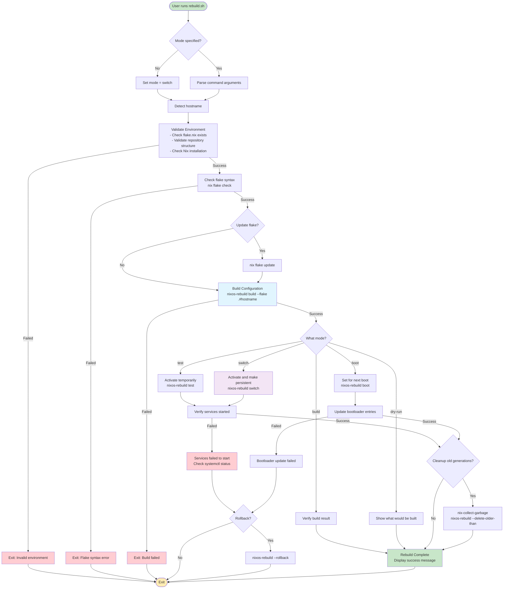
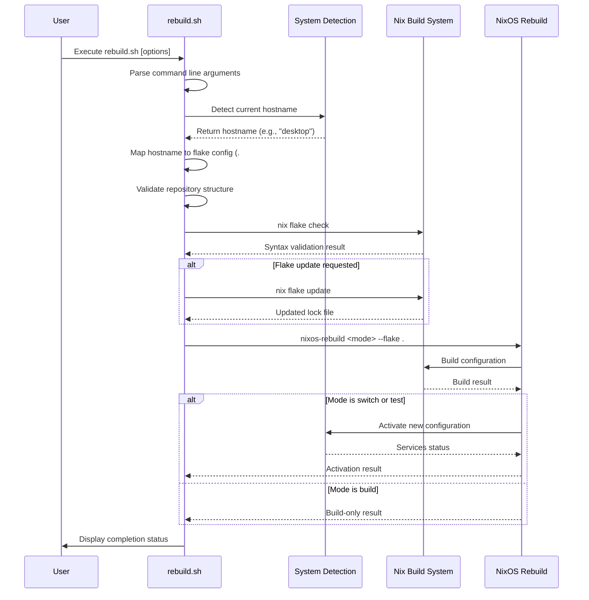

# System Management Scripts - Comprehensive Documentation

## Directory Purpose
This directory contains essential utility scripts for managing the NixOS configuration lifecycle, including installation automation, system rebuilding, code formatting, and maintenance operations. These scripts provide the primary interface for deploying, updating, and maintaining NixOS systems.

## Script Overview and Usage

### Installation Scripts

#### `bootstrap.sh` - One-Line Web Installation
**Purpose**: Quick bootstrap script that can be executed directly from the web for rapid NixOS installation setup.

**Usage**:
```bash
# Direct web execution (from NixOS ISO)
curl -sSL https://raw.githubusercontent.com/hbohlen/nixos/main/scripts/bootstrap.sh | bash

# Local execution
./scripts/bootstrap.sh
```

**Features**:
- **Minimal Dependencies**: Works with basic NixOS ISO environment
- **Automatic Setup**: Downloads repository and begins installation process
- **Error Handling**: Comprehensive error checking and user feedback
- **Network Validation**: Checks internet connectivity and repository access
- **Environment Preparation**: Sets up necessary tools and environment

**Process Flow**:
1. Validates internet connection and basic tools
2. Downloads the NixOS configuration repository
3. Verifies repository integrity and structure
4. Launches the main installation script (`install.sh`)
5. Provides user feedback and error reporting

**Troubleshooting**:
- **Network Issues**: Check internet connection and DNS resolution
- **Download Failures**: Verify repository URL and network access
- **Permission Errors**: Ensure script execution permissions
- **Missing Tools**: Verify basic tools (curl, bash) are available

#### `install.sh` - Comprehensive System Installation
**Purpose**: Full-featured NixOS installation script implementing disko-ZFS-impermanence architecture from NixOS live ISO.

**Usage**:
```bash
# Interactive installation
./scripts/install.sh

# Automated installation with hostname
./scripts/install.sh --hostname desktop

# Advanced options
./scripts/install.sh --hostname laptop --dry-run --verbose
```

**Command Line Options**:
- `--hostname HOST`: Specify target hostname (desktop, laptop, server)
- `--dry-run`: Preview operations without making changes
- `--verbose`: Enable detailed output and debugging
- `--force`: Override safety checks (use with caution)
- `--help`: Display usage information and options

**Installation Architecture**:
```
┌─────────────────────────────────────┐
│           LUKS Encryption           │
│  ┌─────────────────────────────────┐ │
│  │          ZFS Pool (rpool)       │ │
│  │  ┌─────────────────────────────┐│ │
│  │  │     Ephemeral Root (/)      ││ │
│  │  │       (tmpfs)               ││ │
│  │  ├─────────────────────────────┤│ │
│  │  │   Persistent Storage        ││ │
│  │  │      (/persist)             ││ │
│  │  └─────────────────────────────┘│ │
│  └─────────────────────────────────┘ │
└─────────────────────────────────────┘
```

**Key Features**:
- **Disk Partitioning**: Automated disk layout using disko
- **ZFS Setup**: Pool creation, dataset configuration, snapshot setup
- **LUKS Encryption**: Full disk encryption with secure key management
- **Impermanence**: Ephemeral root with selective persistence
- **Hardware Detection**: Automatic hardware configuration generation
- **User Setup**: User account and SSH key configuration

**Installation Process**:
1. **Preparation Phase**:
   - Validate environment and dependencies
   - Detect and configure target disk
   - Generate encryption keys and passphrases
   
2. **Disk Configuration**:
   - Create GPT partition table
   - Set up EFI system partition
   - Configure LUKS encryption
   - Create ZFS pool and datasets
   
3. **System Installation**:
   - Mount filesystems and prepare chroot
   - Generate hardware configuration
   - Install NixOS with flake configuration
   - Configure bootloader and initrd
   
4. **Post-Installation**:
   - Set up user accounts and SSH keys
   - Configure impermanence and persistence
   - Create initial ZFS snapshots
   - Verify installation integrity

**Troubleshooting Installation Issues**:

##### Disk and Partition Problems
**Symptoms**: Disk detection failures, partitioning errors, mount failures
**Diagnosis**:
```bash
# Check disk status
lsblk -f
fdisk -l
# Check ZFS pool status
zpool status
zpool import
```
**Solutions**:
- Verify disk device paths and availability
- Check for existing partitions or filesystems
- Use `--force` flag to override existing data (destructive)
- Manually clean disk with `wipefs -a /dev/sdX`

##### ZFS Configuration Issues
**Symptoms**: Pool creation failures, dataset mount issues
**Diagnosis**:
```bash
# Check ZFS modules
modprobe zfs
lsmod | grep zfs
# Check pool configuration
zpool status -v
zfs list
```
**Solutions**:
- Ensure ZFS kernel modules are loaded
- Verify disk space and partition alignment
- Check ZFS feature compatibility
- Use alternative pool names if conflicts exist

##### Network and Repository Issues
**Symptoms**: Repository clone failures, package download issues
**Diagnosis**:
```bash
# Check network connectivity
ping github.com
# Test repository access
git clone https://github.com/hbohlen/nixos.git /tmp/test
# Check DNS resolution
nslookup github.com
```
**Solutions**:
- Verify internet connection and routing
- Check DNS configuration and resolution
- Use alternative repository URLs or mirrors
- Configure proxy settings if needed

### System Management Scripts

#### `rebuild.sh` - Automated System Rebuilding
**Purpose**: Primary script for system updates and rebuilding that automatically detects hostname and applies appropriate configuration.

**Usage**:
```bash
# Auto-detect hostname and rebuild
./scripts/rebuild.sh

# Specify hostname explicitly  
./scripts/rebuild.sh desktop

# Test build without switching
./scripts/rebuild.sh --test

# Build with specific flake
./scripts/rebuild.sh --flake .#laptop
```

**Command Line Options**:
- `--test`: Build configuration without activating (safe testing)
- `--dry-run`: Show what would be built without building
- `--verbose`: Enable detailed output and timing information
- `--flake FLAKE`: Specify custom flake path
- `--rollback`: Rollback to previous generation
- `--help`: Display usage and options

**Features**:
- **Hostname Detection**: Automatically identifies current system hostname
- **Configuration Selection**: Maps hostname to appropriate flake configuration
- **Safety Checks**: Validates configuration before building
- **Progress Reporting**: Real-time progress and status updates
- **Error Recovery**: Comprehensive error handling and recovery suggestions

**Rebuild Process**:
1. **Environment Validation**:
   - Check for flake.nix and repository structure
   - Validate current working directory
   - Detect system hostname and configuration
   
2. **Configuration Building**:
   - Build NixOS configuration with specified options
   - Validate configuration syntax and dependencies
   - Check for potential conflicts or issues
   
3. **System Activation**:
   - Switch to new configuration (unless --test)
   - Update system generation links
   - Restart affected services
   
4. **Post-Rebuild**:
   - Verify system status and services
   - Clean up old generations (if configured)
   - Update system state tracking

**Rebuild Process Flow Diagram**:



**Rebuild Detection and Configuration Selection**:



**Troubleshooting Rebuild Issues**:

##### Build Failures
**Symptoms**: Compilation errors, dependency conflicts, syntax errors
**Diagnosis**:
```bash
# Check flake syntax
nix flake check --show-trace
# Build with verbose output
nixos-rebuild build --flake .#hostname --show-trace
# Check system status
systemctl --failed
```
**Solutions**:
- Fix syntax errors in configuration files
- Resolve dependency conflicts and version mismatches
- Update flake inputs with `nix flake update`
- Use `--rollback` to return to previous working generation

##### Service Activation Issues
**Symptoms**: Services fail to start, system instability after rebuild
**Diagnosis**:
```bash
# Check service status
systemctl status <service>
journalctl -u <service> -f
# Check system generation
ls -la /nix/var/nix/profiles/system*
```
**Solutions**:
- Review service configuration changes
- Use `nixos-rebuild test` for non-persistent testing
- Rollback to previous generation if needed
- Check service dependencies and ordering

#### `format.sh` - Code Formatting and Style Enforcement
**Purpose**: Maintains consistent code style across all Nix files using multiple formatters and style checkers.

**Usage**:
```bash
# Format all files in repository
./scripts/format.sh

# Check formatting without making changes
./scripts/format.sh --check

# Format specific directory
./scripts/format.sh modules/

# Use specific formatter
./scripts/format.sh --formatter nixfmt
```

**Supported Formatters**:
- **nixfmt-rfc-style**: RFC-compliant Nix formatting
- **alejandra**: Fast Nix code formatter
- **prettier**: Multi-language formatter with Nix support
- **Custom rules**: Project-specific formatting rules

**Features**:
- **Multi-formatter Support**: Uses best available formatter
- **Recursive Processing**: Formats entire directory trees
- **Pre-commit Integration**: Can be used as pre-commit hook
- **Validation Mode**: Check formatting without changes
- **Backup Creation**: Creates backups before formatting (optional)

**Code Style Standards**:
```nix
# Example properly formatted Nix code
{ config, pkgs, lib, inputs, ... }:

with lib;

{
  # Options with proper documentation
  options.myModule = {
    enable = mkEnableOption "my custom module";
    
    package = mkOption {
      type = types.package;
      default = pkgs.my-package;
      description = "Package to use for my module";
    };
    
    settings = mkOption {
      type = types.attrs;
      default = { };
      description = "Additional settings for the module";
    };
  };

  # Configuration with proper conditionals
  config = mkIf config.myModule.enable {
    environment.systemPackages = [ config.myModule.package ];
    
    # Proper list formatting with trailing commas
    services.myService = {
      enable = true;
      settings = config.myModule.settings // {
        defaultSetting = "value";
        listSetting = [
          "item1"
          "item2"
          "item3"
        ];
      };
    };
  };
}
```

**Troubleshooting Formatting Issues**:

##### Formatter Not Found
**Symptoms**: Script fails with formatter not available
**Solutions**:
- Install required formatters: `nix-shell -p nixfmt alejandra`
- Use alternative formatter with `--formatter` option
- Install npm dependencies if using Prettier

##### Formatting Conflicts  
**Symptoms**: Different formatters produce different results
**Solutions**:
- Use single consistent formatter across project
- Configure formatter preferences in script
- Use `--check` mode to identify formatting issues

## Script Dependencies and Environment

### System Requirements
- **NixOS Environment**: Scripts designed for NixOS systems and ISO
- **Internet Access**: Required for package downloads and repository access
- **Administrative Access**: Some operations require sudo privileges
- **Disk Space**: Sufficient space for system builds and temporary files

### External Dependencies
- **Git**: Version control operations and repository management
- **Nix with Flakes**: Modern Nix with flakes support enabled
- **curl/wget**: Network download capabilities
- **Standard Unix Tools**: bash, coreutils, findutils

### Development Dependencies  
- **Node.js/npm**: For prettier formatter and package management
- **Formatters**: nixfmt, alejandra, or other Nix formatters
- **Build Tools**: Tools required for package compilation

## Best Practices and Security

### Script Security
- **Input Validation**: All user inputs are validated and sanitized
- **Error Handling**: Comprehensive error checking and recovery
- **Privilege Escalation**: Minimal use of elevated privileges
- **Temporary Files**: Secure handling of temporary files and cleanup
- **Network Security**: Secure network operations and certificate validation

### Maintenance Guidelines
- **Regular Testing**: Test scripts on all supported configurations
- **Error Path Testing**: Test error conditions and recovery procedures
- **Documentation Updates**: Keep documentation current with script changes
- **Version Compatibility**: Ensure compatibility with NixOS versions
- **Performance Monitoring**: Monitor script performance and optimize

### Development Standards
- **Code Quality**: Follow shell scripting best practices
- **Error Messages**: Provide clear, actionable error messages
- **Progress Indication**: Show progress for long-running operations
- **Logging**: Comprehensive logging for debugging and audit
- **Configuration**: Make scripts configurable for different environments

This comprehensive documentation ensures that system management scripts are well understood, properly used, and effectively maintained across different environments and use cases.